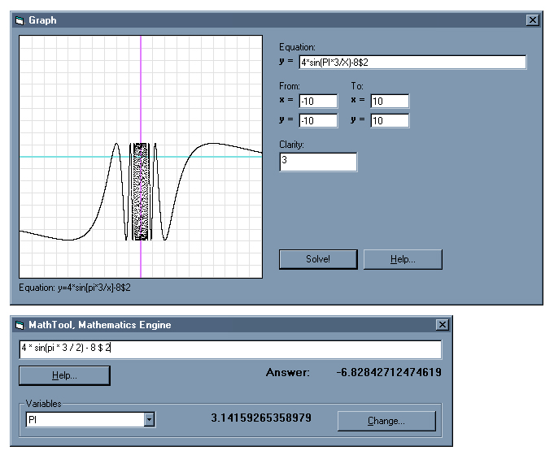



## Mathematic expression solver

### Description

This package contains the MathTool class and three demonstration programs to illustrate its usefullness including a simple scientific calculator, a simple expression solver, and a 2D graphing plot. The MathTool class included inputs a mathematical expression string (such as "1+1" or something like

"3*exp(4)/(cos(pi)-1)") and processes it through a totally cool algorythm that sorts the parts by operators and parenthesis. Same concept if you were to type a math problem into Google Search.
 
### More Info
 
Takes in a mathematical expression such as this:

3*exp(4)/(cos(pi)-1)

This is a really cool mathematical expression solver.

Would return -81.8972250497163 for the expression

3*exp(4)/(cos(pi)-1). You can easily program in more functions and the like, so it can make a really comprehensive scientific calculator.

May cause addiction, resulting in loss of sleep, abstinance from social interaction, malnutrition, poor hygiene, and even death.

             |
---                |---
**Submitted On**   |2002-02-27 18:12:16
**By**             |[Jon Feucht](https://github.com/Planet-Source-Code/PSCIndex/blob/master/ByAuthor/jon-feucht.md)
**Level**          |Advanced
**User Rating**    |4.9 (94 globes from 19 users)
**Compatibility**  |VB 6\.0
**Category**       |[Math/ Dates](https://github.com/Planet-Source-Code/PSCIndex/blob/master/ByCategory/math-dates__1-37.md)
**World**          |[Visual Basic](https://github.com/Planet-Source-Code/PSCIndex/blob/master/ByWorld/visual-basic.md)
**Archive File**   |[Mathematic581462272002\.zip](https://github.com/Planet-Source-Code/jon-feucht-mathematic-expression-solver__1-32134/archive/master.zip)

